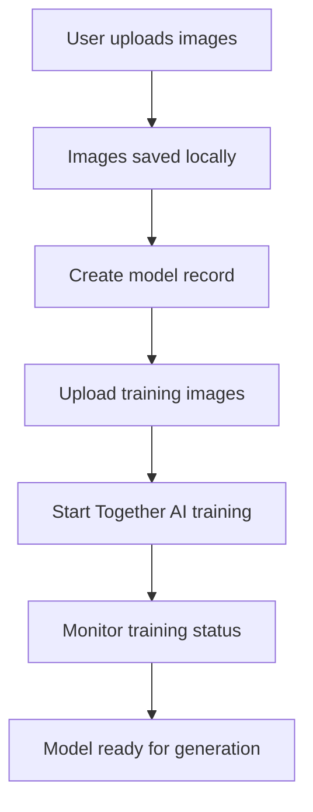

# Together AI Training Integration

## Overview
We have successfully implemented real Together AI LoRA training integration for the Fine-tuned Image Generation service. This connects the model creation workflow to actual AI training using Together AI's fine-tuning API.

## Implementation Details

### 1. Training Images Upload API
**File**: `src/app/api/models/training-images/route.ts`
- Handles uploading training images for a specific model
- Saves images to local storage (`public/uploads/{userId}/`)
- Creates database records in `TrainingImage` table
- Generates accessible URLs for Together AI to access images
- Validates file formats, sizes, and counts

### 2. Training Start API  
**File**: `src/app/api/models/start-training/route.ts`
- Initiates actual Together AI LoRA training
- Uses `TogetherAIService.trainLoRA()` method
- Creates job queue entries for monitoring
- Updates model status and stores Together AI job ID
- Handles training failures gracefully

### 3. Updated Model Creation Flow
**File**: `src/app/dashboard/models/new/page.tsx`
- Enhanced UI with trigger word and base model selection
- Multi-step process:
  1. Create model record
  2. Upload training images  
  3. Start Together AI training
- Real-time progress feedback
- Better validation (minimum 5 images recommended)

### 4. Enhanced Model Creation API
**File**: `src/app/api/models/create/route.ts`
- Added support for `triggerWord`, `baseModel`, `skipTraining` parameters
- Backward compatibility with legacy `imageIds` format
- Flexible workflow for different training approaches

## Workflow



## Key Features

### ✅ Real Together AI Integration
- Uses actual Together AI LoRA fine-tuning API
- Supports FLUX.1 base models (Dev, Schnell, Pro)
- Configurable training parameters (learning rate, epochs, etc.)

### ✅ Local Storage for MVP
- Images stored in `public/uploads/{userId}/`
- Database records track image metadata
- URLs accessible for Together AI training

### ✅ Enhanced UI/UX
- Step-by-step model creation process
- Real-time progress feedback
- Better validation and error handling
- Trigger word configuration
- Base model selection

### ✅ Robust Error Handling
- Training failures tracked in database
- Job queue system for monitoring
- Graceful fallbacks and user feedback

### ✅ Database Integration
- `TrainingImage` records for uploaded images
- `JobQueue` entries for training status
- Model status tracking (`pending`, `training`, `ready`, `failed`)

## Configuration

### Environment Variables
```bash
TOGETHER_API_KEY=your_together_ai_api_key
NEXTAUTH_URL=http://localhost:3000  # For local image URLs
```

### Together AI Settings
- Default base model: `black-forest-labs/FLUX.1-dev`
- Learning rate: `0.0002`
- Epochs: `100`
- Batch size: `1`
- Resolution: `1024px`

## API Endpoints

### POST `/api/models/training-images`
Upload training images for a model
```javascript
// FormData with:
// - images: File[]
// - userModelId: string
```

### POST `/api/models/start-training`
Start Together AI training
```javascript
{
  "modelId": "model_id",
  "trainingImages": [
    {
      "id": "image_id",
      "filename": "image.jpg", 
      "url": "http://localhost:3000/uploads/user/image.jpg",
      "size": 1024000
    }
  ]
}
```

### POST `/api/models/create`
Create model (enhanced)
```javascript
{
  "name": "My Model",
  "description": "Custom LoRA model",
  "triggerWord": "johndoe_person",
  "baseModel": "black-forest-labs/FLUX.1-dev",
  "skipTraining": true  // For new workflow
}
```

## Testing

### Manual Testing
1. Navigate to `/dashboard/models/new`
2. Upload 5+ training images
3. Fill in model details
4. Submit and monitor training progress

### API Testing
```bash
# Test image generation (verify Together AI connectivity)
node scripts/test-together-training.js
```

## Next Steps

1. **Background Job Processing**: Implement worker to monitor training status
2. **Training Status Dashboard**: Real-time training progress updates
3. **Custom Model Generation**: Use trained models for image generation
4. **Advanced Training Options**: More configuration options for power users
5. **S3 Integration**: Move from local storage to S3 for production

## File Structure

```
src/
├── app/api/models/
│   ├── create/route.ts              # Enhanced model creation
│   ├── training-images/route.ts     # Training image upload
│   └── start-training/route.ts      # Start Together AI training
├── app/dashboard/models/new/page.tsx # Enhanced model creation UI
├── lib/
│   ├── together-ai.ts              # Together AI service (existing)
│   └── upload.ts                   # Local file upload utilities
└── components/upload/
    └── ImageUpload.tsx             # Image upload component
```

## Status: ✅ COMPLETE

The real Together AI training integration is now implemented and ready for testing. Users can upload training images, configure model parameters, and start actual LoRA fine-tuning through the Together AI API. 