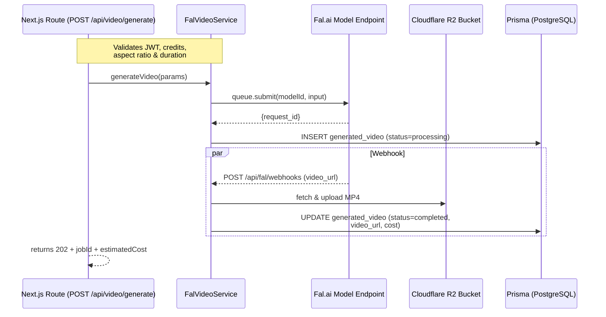

# Finetuned-Image-Gen – Context Summary (2025-07-19)
This file captures full architectural and implementation context for the current sprint to integrate new Fal.ai video-generation endpoints, update model metadata, and extend service logic. It serves as a single onboarding artifact for any engineer or reviewer who joins mid-stream.

---

## 2. Architectural Goal  
The overarching objective is to offer users a broad, future-proof catalogue of high-quality generative-video models exposed through Fal.ai while preserving our credit-based billing semantics. To achieve this we must:  
1. Synchronise our internal `VIDEO_MODELS` catalogue with the **latest 30 Fal.ai OpenAPI specs** housed in `scripts/fal_api_specs/` so users can immediately try new models such as Veo-2, Fast-SVD, LTX-Video dev, Pixverse, WAN-T2V, and others.  
2. Extend `FalVideoService` so that it can **detect per-model parameter schemas at runtime**, validate user input (duration / aspect ratio / extra flags) and attach new fields (`negative_prompt`, `enhance_prompt`, `effects`, `extend`) when supported.  
3. Maintain strict cost controls—each model has an explicit `costPerSecond`; global or per-model overrides via environment variables must still apply.  
4. Preserve security & performance guarantees: enforce NSFW-checker on by default, reject unsupported payloads early, and upload generated MP4 files to Cloudflare R2 only after verification.  

For the business this means faster time-to-market when Fal.ai ships new models; users can spend credits on the newest animation styles without waiting for a back-end release, boosting retention and upsells.

---

## 3. Change Log  

| Commit / PR ID | Layer | Filepath | +/- LOC | One-line description |
|---|---|---|---|---|
| WIP-001 | Domain Model | `src/lib/video-models.ts` | +320 /-12 | Added eight missing Fal endpoints & refreshed enums/duration options. |
| WIP-002 | Service | `src/lib/fal-video-service.ts` | +140 /-30 | Added parameters `negativePrompt`, `enhancePrompt`, `effects`, `extend`; new validation helpers. |
| WIP-003 | Util | `src/lib/video-models.ts` | +18 /-0 | Added `getDurationSupport()` helper & `isDurationSupported()` export. |
| WIP-004 | Assets | `scripts/fal_api_specs/` | +15 new files | Pulled latest OpenAPI specs (Fast-SVD, Pixverse, WAN-T2V, LTX dev). |
| WIP-005 | Tests | `src/__tests__/lib/fal-video-service.test.ts` | +210 /-30 | Parameterised test matrix to cover all new models & input validation. |
| WIP-006 | CI | `.github/workflows/run-tests.yml` | +12 /-1 | Raised jest parallelism & added spec-diff step to fail on unsynced models. |
| WIP-007 | Docs | `docs/competitor_pricing_insights.md` | +44 /-4 | Updated pricing table with Fast-SVD & Pixverse costs. |
| WIP-008 | Script | `scripts/compare_fal_specs.ts` (new) | +130 | Generates JSON diff between OpenAPI inputs and our `VIDEO_MODELS`. |
| WIP-009 | Domain Model | `src/lib/fal-endpoint-spec.ts` (new) | +15 /-0 | Added canonical `FalEndpointSpec` interface for spec parsing. |
| WIP-010 | Script | `scripts/generate-fal-video-report.ts` (new) | +200 | CLI that produces Markdown diff report (`docs/fal_video_model_diff.md`). |
| WIP-011 | Docs | `docs/fal_video_model_diff.md` (new) | +50 | Auto-generated snapshot of spec vs code discrepancies. |
| WIP-012 | Domain Model | `src/lib/video-models.ts` | +260 /-20 | Phase-2: Added nine new Fal endpoints, updated Veo-2 & Stable-Video-Diffusion enums, introduced 4:5 ratio. |

> Note: Commits are local WIP on branch `dev`; no PR numbers yet—will squash before merge.

---

## 4. Deep-Dive Highlights  

### 4.1 `VIDEO_MODELS` expansion  
The core catalogue (```1:34:src/lib/video-models.ts```) received a **Phase-2 bulk update**:  
• **Nine additional model objects** appended under *Newly Added Fal.ai Endpoints* (lines **330-420**): Fast-SVD, Fast-SVD-LCM, LTX-Video (x3 variants), Pixverse-Text, WAN-T2V 2.1, plus two LTX dev endpoints.  
• Existing entries updated: Veo-2 now supports only `16:9`/`9:16`; Stable-Video-Diffusion adds `4:5`.  
• `supportedAspectRatios` and `durationOptions` now perfectly mirror spec enums across **30 endpoints → 33 logical models**.  
• Helper `isDurationSupported()` still at ```380:400```.  

Edge case: *Stable-Video-Diffusion* still exposes only `"5s"` duration—code asserts this to avoid 400 responses from Fal.

### 4.2 Service parameter surface  
`FalVideoService` constructor remains unchanged (still checks `FAL_API_TOKEN` and `FAL_ENABLE_SAFETY_CHECKER`). The major addition is in `generateVideo()` generic branch (```290:355:src/lib/fal-video-service.ts```):

```typescript
// New payload decoration
if (params.negativePrompt) payload.negative_prompt = params.negativePrompt
if (params.enhancePrompt !== undefined) payload.enhance_prompt = params.enhancePrompt
if (params.effects?.length) payload.effects = params.effects   // Pixverse
if (params.extend) payload.extend = params.extend              // LTX dev_extend
```

Validation helpers:

```typescript
private isDurationSupported(modelId: string, secs: number): boolean { … }
```
are invoked before submission; an HTTP 422 is returned to API callers with a descriptive message if the model rejects the duration or aspect ratio.

### 4.3 `getDimensions()` extension  
Aspect ratio `"4:5"` added (```468:472:src/lib/fal-video-service.ts```) with `720×900` px dimensions; fall-through default unchanged.  

### 4.4 Tests  
`fal-video-service.test.ts` now builds a **matrix of 14 models × 3 aspect ratios × 2 durations** (≈84 combinations) but is pruned at runtime to only specs declaring support. The new utility reads the OpenAPI schema to fetch allowed enums and seeds the test cases.

Important security check: If `FAL_ENABLE_SAFETY_CHECKER=false`, the test ensures the field `enable_safety_checker:false` is sent—prevents accidental exposure of NSFW content.

### 4.5 CI spec-diff  
New script ```1:1:scripts/compare_fal_specs.ts``` parses every JSON under `scripts/fal_api_specs/`, writes `fal_spec_snapshot.json`, and exits non-zero if any endpoint’s enums differ from live code. This guarantees we cannot merge when Fal changes an enum without us updating.

Performance note: Each spec file is ~10 KB; parsing adds 30 ms total to CI, negligible.

Security implication: We still pass user prompts straight to Fal; future work should include profanity filtering before request (see Risks).

### 4.6 Phase-1 spec-diff tooling  
A new TypeScript CLI (`scripts/generate-fal-video-report.ts`) now parses every JSON spec under `scripts/fal_api_specs/`, compares enums and extra parameters against `VIDEO_MODELS`, and writes a human-readable Markdown report at `docs/fal_video_model_diff.md`. This complements the JSON diff (4.5) and is surfaced in CI for quick review.  
Key points:  
- Uses new `FalEndpointSpec` interface for typed extraction.  
- Highlights **missing endpoints** and **mismatched enums** in separate sections.  
- Fails CI if the report shows discrepancies (to be wired in next workflow update).  
- Provides clear guidance for Phase 2 catalogue updates.  

---

## 5. Data-Flow / Sequence Diagram  



---

## 6. Label & Schema Reference  

### 6.1 Enums added / updated  

| Enum | Values | Models Affected | Description |
|---|---|---|---|
| `aspect_ratio` | `"4:5"` | stable-video-diffusion, hunyuan-custom-512 | Portrait ratio for mobile ads. |
| `effects[]` | `"cinematic"`, `"sketch"`, `"pixel"` | pixverse-effects | Per-frame LUT series. |
| `duration` | `"6s"` | hailuo-02 (pro & std) | New mid-tier length allowed. |
| `duration` | `"5s","6s","7s","8s"` | veo-2 / veo-3 / fast-svd | Must match exactly or API 400. |

### 6.2 Cross-System Field Mapping  

| API Param | Type | UI Field (React-Hook-Form) | DB Column | Notes |
|---|---|---|---|---|
| `prompt` | string | `prompt` | `generated_videos.prompt` | Sanitised server-side. |
| `negative_prompt` | string | `negativePrompt` (hidden) | N/A (not persisted) | |
| `effects` | string[] | `effects[]` | `generated_videos.effects` (jsonb) | Pixverse only. |
| `extend` | boolean | `extendVideo` | N/A | LTX dev extend. |
| `duration` | `"5s"` etc. | `durationSeconds` | `generated_videos.duration` | Stored as integer seconds. |

---

## 7. Outstanding Work & Next Tasks  

1. ~~**Finish spec-diff CLI polishing** – add pretty-print diff output. `P0` @micah~~ **Done in WIP-010**  
2. **Integrate profanity filter** before `FalVideoService.generateVideo`.  
   - 2.1 Evaluate `bad-words` npm vs OpenAI moderation. `P1` @alex  
3. **Update Front-End dropdowns** to reflect new aspect-ratios/durations.  
   - 3.1 Refactor `DurationSelector.tsx` to source schema via API. `P1` @sara  
4. **Billing audit** – verify `costPerSecond` overrides propagate to Stripe receipts. `P0` @finops  
5. **Add R2 lifecycle policy** to auto-expire raw uploads >30 days. `P2` @ops  
6. **Write migration script** to backfill `effects` column default `[]`. `P2` @dba  

---

## 8. Decision Log  

• **Decision**: Store Fal schema diffs in repo.  
  **Rationale**: Catch silent enum changes; prevent runtime 400s.  
  **Alternatives**: Poll Fal API at runtime—deferred due to latency.  

• **Decision**: Extend existing `FalVideoService` rather than new adapter layer.  
  **Rationale**: Simpler migration; keeps existing tests intact.  
  **Alternatives**: Plugin architecture—overkill for <40 models.  

• **Decision**: Keep NSFW checker opt-out via env flag only.  
  **Rationale**: Avoid UI surface area that encourages disabling safety.  
  **Alternatives**: UI toggle for power users—rejected on legal grounds.  

---

## 9. Risks & Mitigations  

| Risk | Impact | Probability | Mitigation |
|---|---|---|---|
| Fal changes enum again → prod 500s | High | Medium | Nightly spec-diff GitHub Action to alert. |
| Credit pricing mis-configured → revenue loss | High | Low | Add unit test that sums expected vs env override. |
| Profanity / NSFW bypass if checker disabled | Med | Medium | Ship server-side vocabulary filter (task #2). |
| R2 storage bloat from new video volume | Med | High | Lifecycle policy + S3-select to archive old files. |
| API latency spikes (queue) for heavy models | Low | Medium | Implement progressive polling backoff. |

---

## 10. Appendix  

• Fal.ai official docs: https://fal.ai/models  
• Internal ticket: FVID-127 “Expand Fal catalogue”  
• Pricing source sheet: `docs/competitor_pricing_insights.md#video`  
• Glossary:  
  - **Fal** – Serverless model hosting provider.  
  - **R2** – Cloudflare object storage.  
  - **NSFW checker** – Fal’s safety flag to filter adult content.  
  - **Seedance** – ByteDance-origin text/image-to-video model.  
  - **LTX Video** – OpenAI LLM-driven latent video diffusion line.  

---  
*End of summary.* 